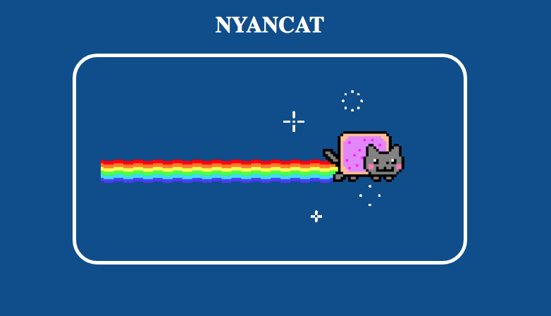
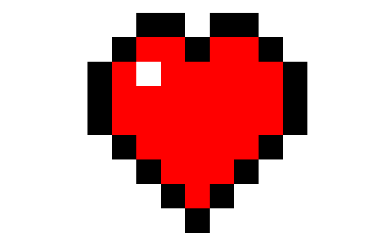
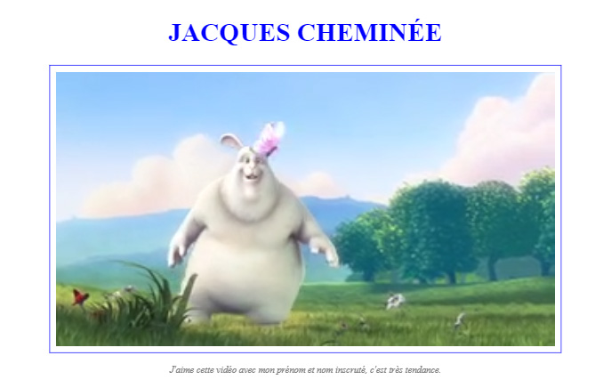

# 07 - Exercices CSS

Vous trouverez ci-après des exercices à rendre sur le langage CSS.

## Exercice 1

Ajouter une CSS pour **faire disparaître l'élément** `#hidden`.

```html
<body>
   <p>Le <strong>Moscow mule</strong> est un cocktail à base de vodka, de bière de gingembre épicée et de jus de citron vert.</p>
   <p id="hidden">Un <strong>French Connection</strong> est un cocktail composé de parts égales de cognac et d'amaretto.</p>
   <p>Le <strong>Long Island Iced Tea</strong> est un cocktail à base de tequila, de gin, de vodka, de rhum et de liqueur d'oranges.</p>
</body>
```

## Exercice 2

Limiter la **largeur** du `<h1>` à `50 %` et augmenter la **hauteur** à `150px`.

```html
<body>
   <h1>Préparer un cocktail</h1>
   <p>Il existe différentes façons de réaliser un cocktail : au verre à mélange, au shaker ou directement au verre.</p>
</body>
```

```css
h1 {
   background: yellow;
}
```

## Exercice 3

Définir une **marge externe gauche** de `30px` pour le `h1`.

```html
<body>
   <h1>Basil Smash</h1>
   <p>Le Basil Smash est un cocktail rafraîchissant de gin, de citron, de sirop de sucre et de basilic frais.</p>
</body>
```

```css
h1 {
   background: lightblue;
}
```

## Exercice 4

Utiliser le raccourci css le plus minimaliste possible pour définir les **marges externes** de `#super` haut et bas à `50px` et celles des côtés droit et gauche à `25px`.

```html
<body>
   <h1 id="super">B-52</h1>
   <p>Le B-52 est un cocktail composé en proportions égales de Kahlua, de Baileys et de Cointreau.</p>
</body>
```

```css
#super {
   background: powderblue;
}
```

## Exercice 5

Définir une **marge interne** en bas de l'élément `h1` de `30px`.

```html
<body>
   <h1>Basil Smash</h1>
   <p>Le Basil Smash est un cocktail rafraîchissant de gin, de citron, de sirop de sucre et de basilic frais.</p>
</body>
```

```css
h1 {
   background: lightblue;
}
```

## Exercice 6

- **Centrer horizontalement les paragraphes** à l'intérieur du premier élément `<div>`.
- Transformer les titres **en majuscules**.

```html
<body>
   <div class="super1">
      <h1>Titre 1</h1>
      <p>Le Moscow mule est un cocktail à base de vodka, de bière de gingembre épicée et de jus de citron vert, accompagné d'une rondelle de citron.</p>
      <p>Le Long Island Iced Tea est un cocktail à base de tequila, de gin, de vodka, de rhum et de liqueur d'oranges.</p>
   </div>
   <div class="super2">
      <h2>Titre 2</h2>
      <p>Un French Connection est un cocktail composé de parts égales de cognac et d'amaretto.</p>
      <h3>Titre 3</h3>
      <p>Le Tequila sunrise est un cocktail à base de tequila, de jus d'orange, et de grenadine.</p>
   </div>
</body>
```

```css
body {
   font-size: 14px;
}
```

## Exercice 7

Écrire le code HTML et la feuille de style CSS **pour obtenir le rendu ci-dessous**, en utilisant l'image ci-dessous.



- [Animation à utiliser](../Ressources/07-1-exercice-css/exo-7-nyamcatrainbow.gif)
- Bleu : `#0f4d8f`

## Exercice 8

Modifier le code HTML et la feuille de style CSS **pour obtenir le rendu ci-dessous**, en utilisant les images suivantes.



- [Carré noir](../Ressources/07-1-exercice-css/exo-8-black.png)
- [Carré blanc](../Ressources/07-1-exercice-css/exo-8-white.png)
- [Carré rouge](../Ressources/07-1-exercice-css/exo-8-red.png)

```html
<body>
    <table></table>
</body>
```

```css
img {
    display: block;
}
table {
    margin: auto;
    border-collapse: collapse;
    border-spacing: 0;
}
td {
    padding: 20px;
    border: 1px black solid;
}
```

## EXERCICE 9

Écrire le code HTML et la feuille de style CSS **pour obtenir le rendu ci-dessous**, en utilisant les images ci-après. 

> *Astuce: aidez vous des alignements et des marges pour ajuster le placement des images.*


- [Image de background](../Ressources/07-1-exercice-css/exo-9-bg.webp)
- [Planet 1](../Ressources/07-1-exercice-css/exo-9-planet-1.png)
- [Planet 2](../Ressources/07-1-exercice-css/exo-9-planet-2.png)
- [Planet 3](../Ressources/07-1-exercice-css/exo-9-planet-3.png)

## Exercice 10

Écrire le code HTML et la feuille de style CSS **pour obtenir le rendu ci-dessous**, en utilisant l'image ci-après.



- [Vidéo](../Ressources/07-1-exercice-css/exo-10.mp4)
- Couleur bleu : `blue`
- Couleur grise : `grey`
