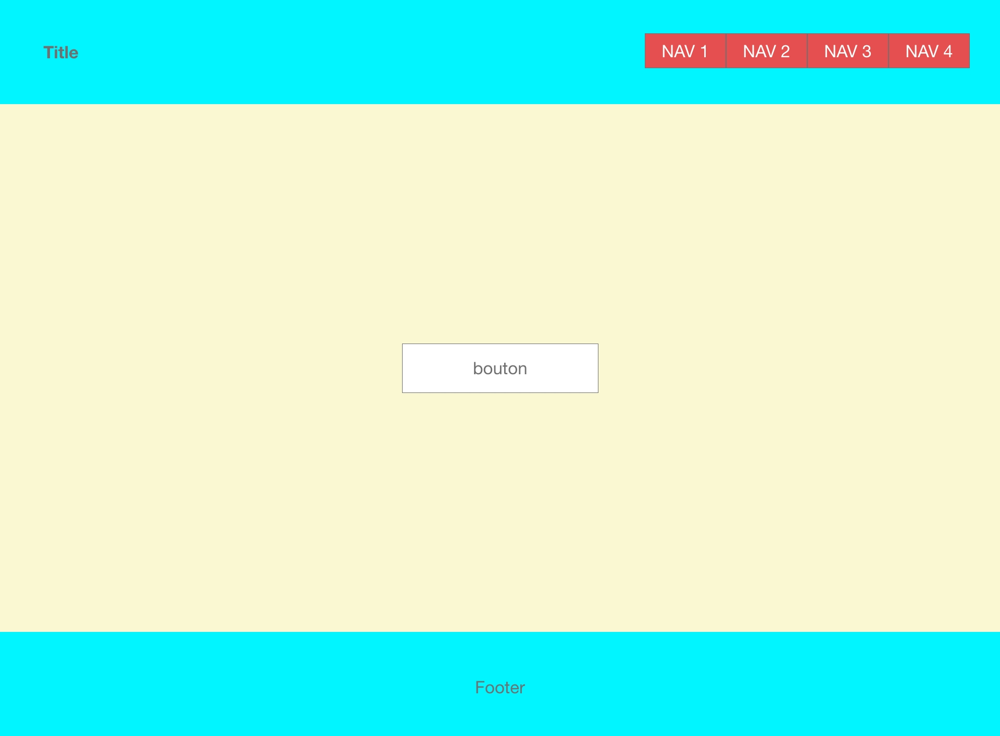

# Exercice mise en page avec flex

En utilisant le [modèle HTML suivant](../Ressources/13-exercice-flex/4-exercice-flex.html)

Compléter la CSS pour réaliser la disposition suivante, en utilisant les conteneur flex.

- le header et le footer doivent avoir une hauteur de 200px;
- le main doit avoir le reste de la hauteur de fenêtre (çàd occuper tout l'écran moins la hauteur du header, footer)
- styler le bouton et le centrer verticalement et horizontalement dans son conteneur
- Réaliser un menu horizontal avec la navigation
- Disposer le title horizontalement à gauche, la navigation à droite, le tout centré verticalement dans le header

Voici une maquette qui permet de prévusualiser le résultat attendu :

